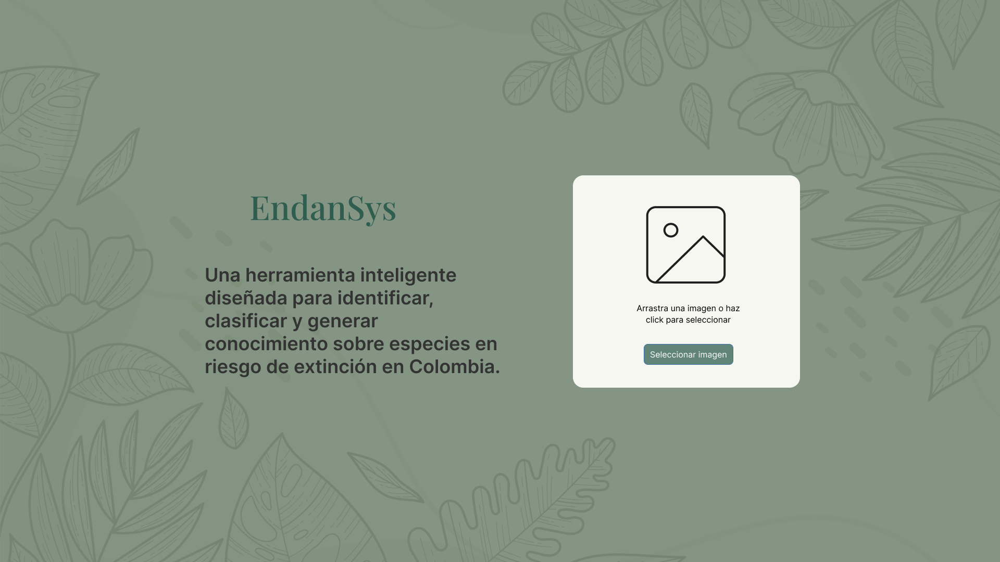
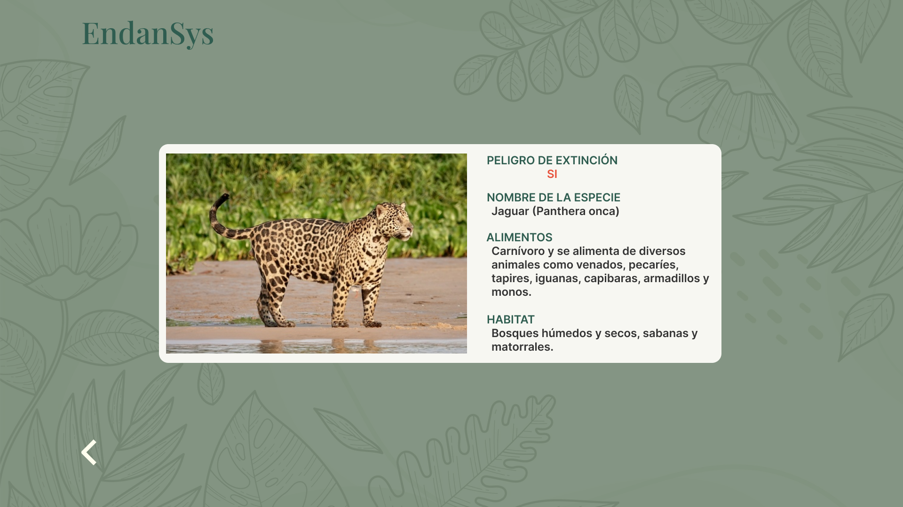
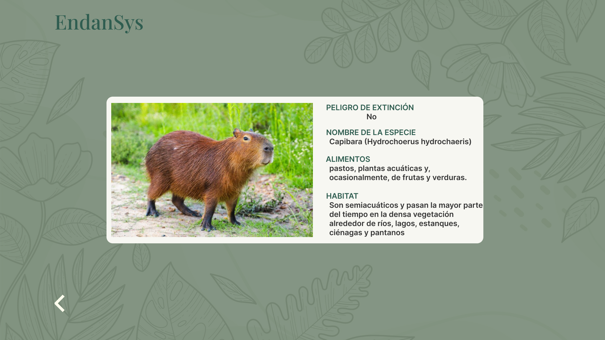
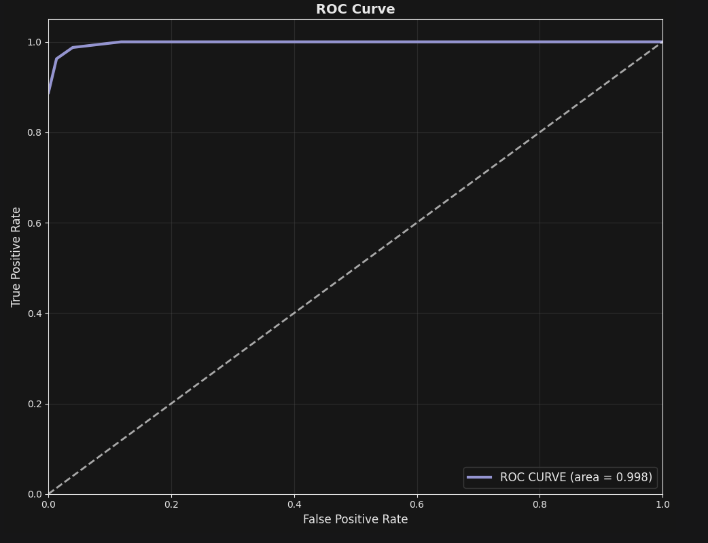

# EndanSys — Endangered Species System



> Una herramienta inteligente basada en Inteligencia Artificial para identificar, clasificar y generar conocimiento sobre especies en riesgo de extinción en Colombia.

---

## Descripción

Colombia es el segundo país más biodiverso del mundo, con 54.875 especies registradas, de las cuales 3.625 son endémicas. Sin embargo, factores como la deforestación, los incendios forestales, la caza ilegal, el cambio climático y la contaminación han llevado a más de 1.700 especies a situación de peligro de extinción.

**EndanSys** responde a esta crisis combinando visión por computador y deep learning para permitir que cualquier persona —desde estudiantes hasta comunidades rurales— pueda:

- \*Identificar\*\* una especie animal a partir de una fotografía
- **Clasificar** si la especie está o no en peligro de extinción
- **Conocer** información contextual: nombre científico, alimentación y hábitat
- **Visualizar** las regiones de Colombia donde habita la especie identificada

---

## Demo

|        Especie en peligro de extinción         |                   Especie sin riesgo                    |
| :--------------------------------------------: | :-----------------------------------------------------: |
|  |                       |
|   Jaguar _(Panthera onca)_ — **EN PELIGRO**    | Capibara _(Hydrochoerus hydrochaeris)_ — **SIN RIESGO** |

---

## Modelo de IA

El núcleo de EndanSys es una red neuronal convolucional basada en **Transfer Learning con ResNet50**, adaptada mediante fine-tuning para la clasificación multiclase de especies animales colombianas.

### Arquitectura

- **Base:** ResNet50 preentrenada (sin capa final)
- **Capas añadidas:** GlobalAveragePooling2D → Dense (ReLU) → Dropout → Softmax
- **Entrada de imágenes:** 224×224 píxeles
- **Data augmentation:** rotaciones, reflejos, zoom e inclinaciones aleatorias

### Métricas de rendimiento

| Métrica                     | Valor      |
| --------------------------- | ---------- |
| Accuracy (tras fine-tuning) | **88.75%** |
| Precision                   | **86%**    |
| Recall                      | **82%**    |
| F1-Score                    | **82%**    |
| AUC (Curva ROC)             | **0.998**  |



---

## Metodología

El proyecto sigue la metodología **CRISP-ML** (extensión de CRISP-DM diseñada para proyectos de Machine Learning), que cubre el ciclo de vida completo del modelo:

1. **Planificación** — Definición de objetivos y alcance
2. **Preparación de datos** — Limpieza, redimensionamiento (224×224), normalización y data augmentation
3. **Ingeniería de modelos** — Diseño de la arquitectura CNN
4. **Implementación** — Transfer Learning con ResNet50 y fine-tuning
5. **Evaluación** — Métricas de clasificación y curva ROC
6. **Supervisión y mantenimiento** — Actualización continua del dataset y monitoreo del accuracy en producción

---

## Estructura del repositorio

```
Endansys/
│
├── assets/                          # Imágenes para el README
├── datasetN/                        # Dataset de imágenes organizado por especie
├── modelo.ipynb                     # Notebook principal: entrenamiento y evaluación
├── model (1).ipynb                  # Versión alternativa del notebook
├── animal_species_classifier.h5     # Pesos del modelo entrenado (ResNet50 + fine-tuning)
├── class_indices.json               # Mapeo índice → nombre de clase
├── etiquetas_animales.csv           # Dataset tabulado: ruta, especie, estado de conservación
├── etiquetas.py                     # Genera el CSV de etiquetas desde la estructura de carpetas
├── renombrar.py                     # Utilitario para renombrar archivos del dataset
└── hola.py                          # Script de prueba
```

> **Convención del dataset:** las carpetas cuyo nombre incluye `_peligro` son etiquetadas automáticamente como especies en peligro de extinción. Ejemplo: `jaguar_peligro/` → en peligro, `capibara/` → sin riesgo.

---

## Instalación y uso

### 1. Clonar el repositorio

```bash
git clone https://github.com/NataliaGiraldoA/Endansys.git
cd Endansys
```

### 2. Instalar dependencias

```bash
pip install tensorflow numpy pandas matplotlib scikit-learn jupyter
```

### 3. Preparar etiquetas del dataset

Ajusta la ruta `base_dir` en `etiquetas.py` según la ubicación de tu dataset, luego ejecuta:

```bash
python etiquetas.py
```

Esto genera `etiquetas_animales.csv` con columnas `filename`, `species` y `status`.

### 4. Entrenar o explorar el modelo

```bash
jupyter notebook modelo.ipynb
```

### 5. Cargar el modelo entrenado para predicciones

```python
from tensorflow.keras.models import load_model
from tensorflow.keras.preprocessing import image
import numpy as np
import json

model = load_model("animal_species_classifier.h5")

with open("class_indices.json") as f:
    class_indices = json.load(f)

# Invertir el diccionario para obtener nombre a partir del índice
index_to_class = {v: k for k, v in class_indices.items()}

# Cargar y preprocesar imagen
img = image.load_img("tu_imagen.jpg", target_size=(224, 224))
img_array = image.img_to_array(img) / 255.0
img_array = np.expand_dims(img_array, axis=0)

# Predecir
predictions = model.predict(img_array)
predicted_class = index_to_class[np.argmax(predictions)]
print(f"Especie identificada: {predicted_class}")
```

---

## Tecnologías

- **Python 3**
- **TensorFlow / Keras** — arquitectura ResNet50 y Transfer Learning
- **Jupyter Notebook** — experimentación y visualización
- **NumPy / Pandas** — procesamiento de datos
- **scikit-learn** — métricas de evaluación (precision, recall, F1, ROC)

---

## Autores

Desarrollado como proyecto académico en la **Universidad San Buenaventura Cali, Colombia**.

| Nombre                              |
| ----------------------------------- |
| Sofía Valencia Solano               |
| Natalia Giraldo Amador              |
| Valerie S. Olave                    |
| Juan P. Bustamante                  |
| Giovanny Hidalgo-Suárez _(docente)_ |

---

## Licencia

Este proyecto es de carácter académico. Todos los derechos reservados a sus autores y a la Universidad San Buenaventura Cali.
